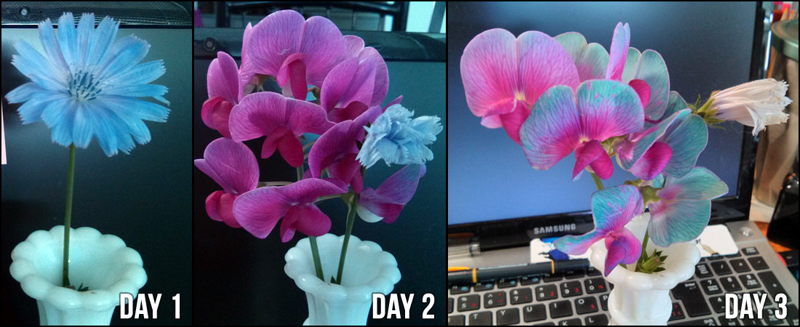
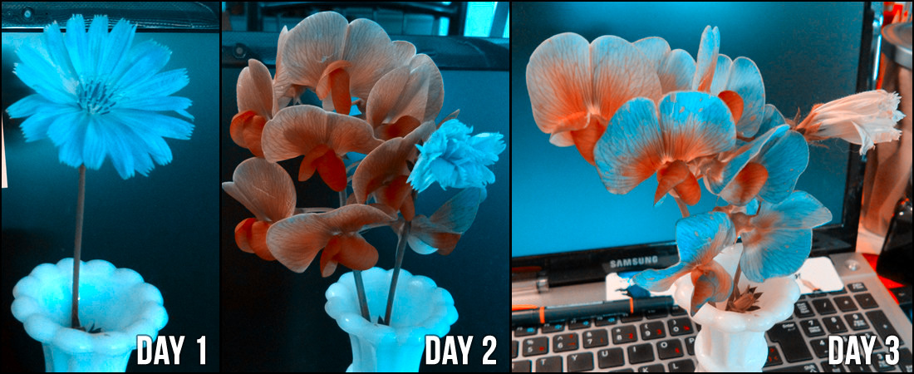

ColorCollapse
=============

A tool to convert all images on a page to ones that color blind people can see

In pictures, Its a tool that turns images like this:

Into 

In the original image, the introduced flower "sucks" the color out of the original flower. This effect is not easily
seen for many colorblind people in the original, but it may be in the processed result.